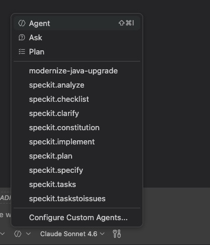

# Timezone Utility — spec-kit Demo

This project demonstrates end-to-end AI-assisted development using [spec-kit](https://github.com/github/spec-kit): starting from a blank directory, a fully implemented .NET CLI tool was built entirely through structured agents in GitHub Copilot Chat. The steps below document exactly what was done — you can follow the same process to build your own project.

## Prerequisites

- [uv](https://docs.astral.sh/uv/) — Python package manager used to install spec-kit
- [VS Code](https://code.visualstudio.com/) with the [GitHub Copilot](https://marketplace.visualstudio.com/items?itemName=GitHub.copilot) extension

---

## Step 1 — Install spec-kit

```bash
uv tool install specify-cli --from git+https://github.com/github/spec-kit.git
```

## Step 2 — Initialize the project

This was run in the project directory:

```bash
specify init . --ai copilot
```

This scaffolded the spec-kit structure and installed the Copilot custom agents.

## Step 3 — Open in VS Code

```bash
code .
```

## Step 4 — How to select a spec-kit agent

All spec-kit agents are available in the Copilot Chat **Agent** mode. Open Copilot Chat, click the **Agent** dropdown (top-left of the chat input), and select the agent you want to invoke.



The agents available are:

| Agent | Purpose |
|---|---|
| `speckit.constitution` | Define project-wide principles and governance |
| `speckit.specify` | Generate a feature specification from a description |
| `speckit.clarify` | Ask targeted questions to tighten an existing spec |
| `speckit.plan` | Produce a technical design and implementation plan |
| `speckit.analyze` | Check consistency across spec, plan, and tasks |
| `speckit.tasks` | Generate a dependency-ordered task list |
| `speckit.checklist` | Produce a custom quality checklist |
| `speckit.implement` | Execute tasks from `tasks.md` |
| `speckit.taskstoissues` | Convert tasks into GitHub Issues |

---

## Step 5 — Establish project principles

The **`speckit.constitution`** agent was invoked with:

```
Create principles focused on code quality, testing standards, user experience
consistency, and performance requirements. Include governance for how these
principles should guide technical decisions and implementation choices.
```

This created `.specify/memory/constitution.md`, which all subsequent agents respected.

---

## Step 6 — Write the feature specification

The **`speckit.specify`** agent was invoked with:

```
Create a command utility that I can use to determine the current date and time
for a given location using the timezone, the name of the location, a zip code
if in the US or whatever else would work to make it easy to use. Add anything
that would be relevant to be able to schedule meetings across timezones easily.
```

This created `specs/<feature>/spec.md`.

> **Optional:** **`speckit.clarify`** can be run after this step to ask up to 5 targeted questions and encode the answers back into the spec before moving on.

---

## Step 7 — Create the implementation plan

The **`speckit.plan`** agent was invoked with:

```
Use .NET core for a single binary deployment and make sure we can generate it
for various OS-es and architectures
```

This created `specs/<feature>/plan.md` with a technical design tailored to the spec and the constitution.

---

## Step 8 — Generate the task list

The **`speckit.tasks`** agent was invoked with:

```
Execute
```

This created `specs/<feature>/tasks.md` with a dependency-ordered list of implementation tasks.

> **Optional:** **`speckit.analyze`** can be run after this step to validate consistency across `spec.md`, `plan.md`, and `tasks.md` before writing any code.

> **Optional:** **`speckit.checklist`** can be run to generate a custom quality checklist tailored to the feature.

---

## Step 9 — Implement

The **`speckit.implement`** agent was invoked with:

```
Execute
```

Large features are not always fully delivered in a single pass. For this project, three passes were needed:

**Pass 1** — `speckit.implement` was run with `Execute`. The agent completed the majority of tasks.

**Pass 2** — `speckit.implement` was run again with `Execute`. The agent picked up the remaining incomplete tasks.

**Pass 3** — `speckit.implement` was run a final time with `Execute`. All tasks were complete.

The number of passes will vary per project depending on scope and complexity.

---

## Result

The fully implemented Timezone Utility CLI — a .NET single-binary tool with timezone conversion, meeting scheduling, location resolution, and profile management — built from a one-sentence description in three implementation passes.
